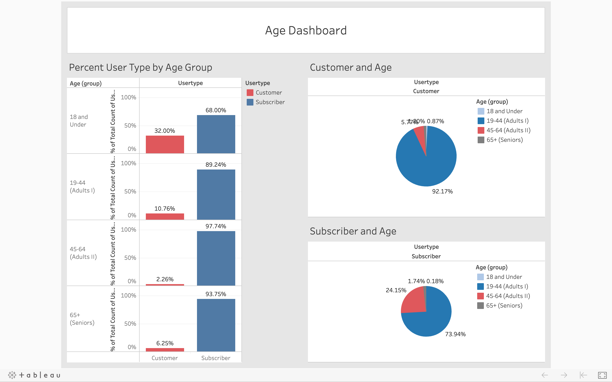
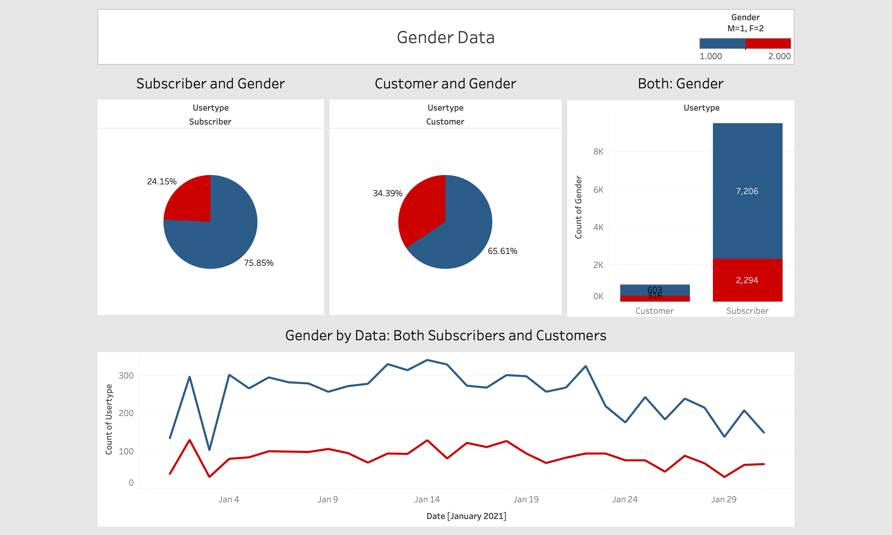

# Citi Bike Dashboards

## Project Summary

* The goal of this project is to create interactive Citi Bike dashboards with Tableau
* The project focuses on demographic data (age and gender) and analyzes customer groups (short vs long term)
* Data was prepared using Python (Pandas)

## Technologies Used

* Python (Pandas)
* Tableau

## Tableau Link
https://public.tableau.com/profile/rachel.chan7842#!/vizhome/CitibikeAnalysis_16135376312980/AgeDashboard

## Data Source
* https://www.citibikenyc.com/system-data

## The Process
* Data was extracted using Pandas. The following columns were kept: Usertype, Gender, Start Station Name, Start Station Latitude, Start Station Longitude, End Station Name, End Station Latitude, End Station Longitude, Birth Year, Time, and Date.
* In order to calculate the user's age at the time, each birth year was subtracted from 2020.
* The data was imported to Tableau, where the visualizations, dashboards, and story were created.
  * In order to analyze user ages, four groups were made using Tableau.

## Visualizations

